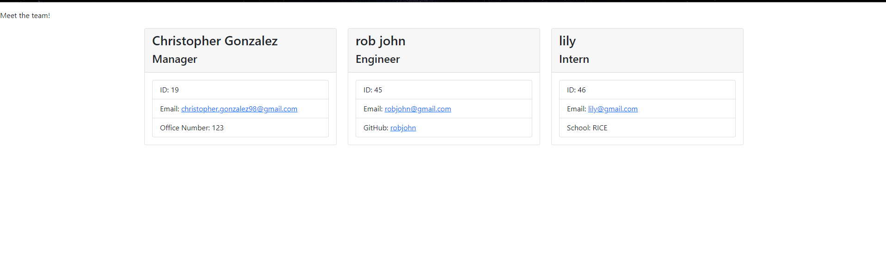

# TeamProfileCard-Generator
  ## Table of Contents
  -[Description](#description)
  -[Installation](#installation)
  -[Usage](#usage)
  -[Contribution](#contribution)
  -[Test](#test)
  -[Questions](#questions)
  -[License](#license)
  

  ## Description
  With the help of inquirer and fs, you are able to create an HTML file were by answering the promt questions cards describing your employees are generated.
  Here is an example of a generated html 
  

  ## Installation
  To install first you must run NPM install, then make sure you have version 8.2.4 of inquirer. Once that is installed. To Run you can type node index.js within the terminal

  ## Usage
  The use of this repository is to be able to generate cards about your employees within an html file by simply answering a coulple of questions.

  ## Contribution 
  None

  ## Test
  to test you can run the debug
  But please see video for a demonstration [here](https://drive.google.com/file/d/1f284zcjQ2xi_QJ4whbiWGPXuW3CqnMqy/view?usp=share_link)

  ## Questions
  For any questions or inquires you can reach me at Email: christopher.gonzalez98@gmail.com
  or visit my Github [chrisjg19](https://github.com/chrisjg19)

  ''
  
 ' '
